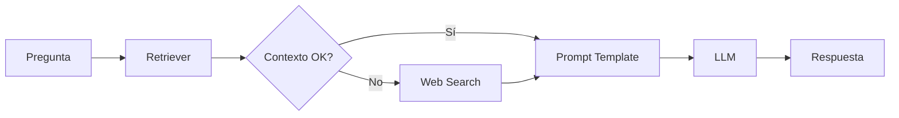

## Visión General

La cadena RAG combina recuperación de documentos con generación de lenguaje para producir respuestas contextualizadas.



---

## create_rag_chain()

Crea una función que implementa el flujo RAG completo.

```python
def create_rag_chain() -> Callable[[str], Dict[str, str]]
```

### Retorno

<ResponseField name="rag_invoke" type="Callable">
  Función que acepta una pregunta y retorna un diccionario con la respuesta.
</ResponseField>

### Esquema de Respuesta

```python
{
    "context": str,   # Contexto utilizado (INAOE o web)
    "question": str,  # Pregunta original
    "answer": str     # Respuesta generada
}
```

### Implementación

```python
def create_rag_chain():
    def rag_invoke(question: str) -> Dict[str, str]:
        # 1. Recuperar documentos relevantes
        docs = retriever.get_relevant_documents(question)
        context = format_docs(docs)
        
        # 2. Fallback a internet si contexto insuficiente
        if not context or len(context.strip()) < 50:
            resultados_web = buscar_en_internet(question)
            contexto_web = "\n\n".join(resultados_web)
            if "No se encontraron" not in contexto_web:
                context = f"[Fuente: Internet]\n{contexto_web}"
        
        # 3. Formatear prompt
        formatted_prompt = prompt.format(
            context=context,
            question=question
        )
        
        # 4. Obtener respuesta del LLM
        response = llm.invoke(formatted_prompt)
        answer = response.content if hasattr(response, 'content') else str(response)
        
        return {
            "context": context,
            "question": question,
            "answer": answer
        }
    
    return rag_invoke
```

---

## cargar_base_datos()

Carga la base de datos vectorial FAISS.

```python
@st.cache_resource
def cargar_base_datos() -> Optional[FAISS]
```

### Retorno

<ResponseField name="db" type="FAISS | None">
  Base de datos vectorial cargada, o `None` si hay error.
</ResponseField>

### Implementación

```python
@st.cache_resource
def cargar_base_datos():
    if not RUTA_DB.exists():
        st.error("❌ No se encontró la base de datos")
        return None
    
    device = 'cuda' if torch.cuda.is_available() else 'cpu'
    embeddings = HuggingFaceEmbeddings(
        model_name="all-MiniLM-L6-v2",
        model_kwargs={'device': device},
        cache_folder=str(RUTA_PROYECTO / "models"),
        encode_kwargs={'normalize_embeddings': True}
    )
    
    return FAISS.load_local(
        str(RUTA_DB),
        embeddings,
        allow_dangerous_deserialization=True
    )
```

<Note>
  El decorador `@st.cache_resource` asegura que la base de datos solo se cargue una vez por sesión.
</Note>

---

## format_docs()

Formatea documentos recuperados para incluir en el prompt.

```python
def format_docs(docs: List[Document]) -> str
```

### Parámetros

<ParamField path="docs" type="List[Document]" required>
  Lista de documentos de LangChain recuperados por FAISS.
</ParamField>

### Retorno

<ResponseField name="formatted" type="str">
  Texto concatenado de todos los documentos, separados por doble salto de línea.
</ResponseField>

### Implementación

```python
def format_docs(docs):
    return "\n\n".join(doc.page_content for doc in docs)
```

---

## buscar_en_internet()

Búsqueda web de fallback usando DuckDuckGo.

```python
def buscar_en_internet(consulta: str, max_resultados: int = 5) -> List[str]
```

### Parámetros

<ParamField path="consulta" type="str" required>
  Texto de búsqueda.
</ParamField>

<ParamField path="max_resultados" type="int" default="5">
  Número máximo de resultados a retornar.
</ParamField>

### Retorno

<ResponseField name="resultados" type="List[str]">
  Lista de strings formateados con título, resumen y URL de cada resultado.
</ResponseField>

### Implementación

```python
def buscar_en_internet(consulta: str, max_resultados: int = 5) -> List[str]:
    from duckduckgo_search import DDGS
    
    try:
        resultados = []
        with DDGS() as ddgs:
            for item in ddgs.text(
                consulta,
                region="wt-wt",
                safesearch="moderate",
                max_results=max_resultados
            ):
                titulo = item.get("title", "")
                cuerpo = item.get("body", "")
                link = item.get("href", "")
                resultados.append(
                    f"Título: {titulo}\nResumen: {cuerpo}\nFuente: {link}"
                )
        return resultados if resultados else ["No se encontraron resultados"]
    except Exception as e:
        return [f"Error en búsqueda web: {e}"]
```

---

## PROMPT_TEMPLATE

Template estructurado para el prompt del LLM.

```python
PROMPT_TEMPLATE = """
Eres un Asistente de Investigación Senior del INAOE...

**MISIÓN PRINCIPAL:**
1. PRIORIDAD 1: CONTEXTO de documentos INAOE
2. PRIORIDAD 2: Conocimiento general del modelo
3. PRIORIDAD 3: Fuentes verificables
4. PRIORIDAD 4: Búsqueda en internet (fallback)

**FORMATO DE SALIDA:**
- Resumen Ejecutivo (TL;DR)
- Análisis Detallado
- Conclusión e Implicaciones
- Fuentes Consultadas

---
**CONTEXTO PROPORCIONADO:**
{context}

**PREGUNTA DEL INVESTIGADOR:**
{question}
"""
```

### Variables

| Variable | Descripción |
|----------|-------------|
| `{context}` | Texto de documentos recuperados o resultados web |
| `{question}` | Pregunta del usuario |

---

## Retriever Configuration

El retriever se configura con el parámetro `k` (número de documentos):

```python
retriever = db.as_retriever(search_kwargs={"k": chunk_size})
```

| Valor k | Efecto |
|---------|--------|
| 3 | Respuestas rápidas, menos contexto |
| 5 | Balance (default) |
| 10 | Más contexto, respuestas más completas |
