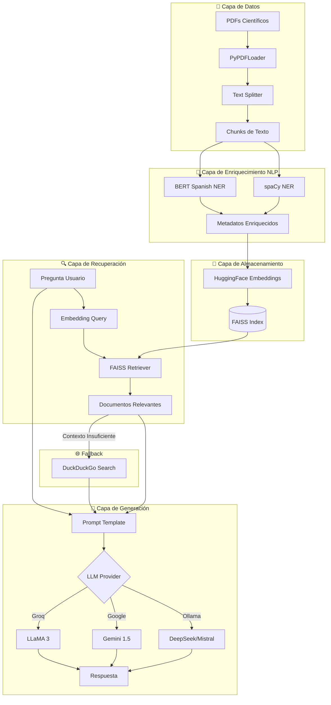
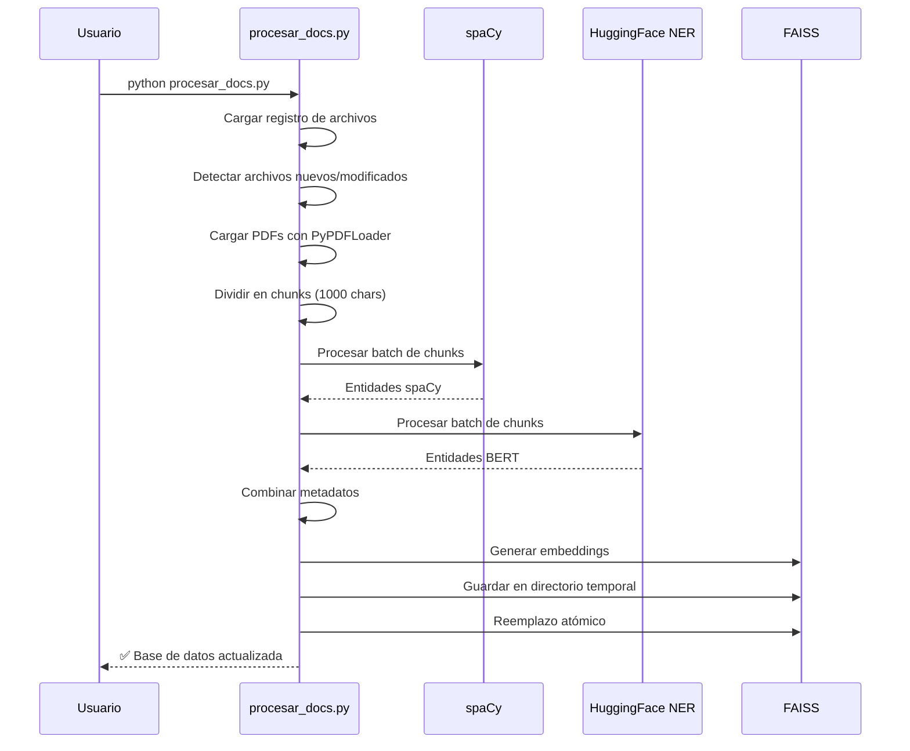
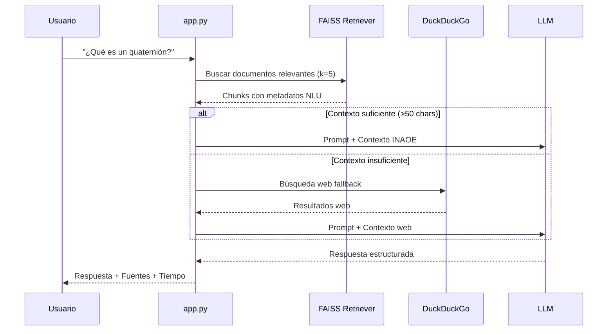

## Visión General

El Asistente INAOE implementa una arquitectura **RAG (Retrieval-Augmented Generation)** que combina búsqueda semántica con generación de lenguaje natural para responder preguntas sobre documentos científicos.

## Diagrama de Arquitectura



## Componentes Principales

<CardGroup cols={2}>
  <Card title="app.py" icon="window" href="/components/app">
    **336 líneas** - Interfaz Streamlit, cadena RAG, fábrica de LLMs
  </Card>
  <Card title="procesar_docs.py" icon="gears" href="/components/procesar-docs">
    **270 líneas** - Pipeline ETL, enriquecimiento NLP, actualización FAISS
  </Card>
  <Card title="utils.py" icon="toolbox" href="/components/utils">
    **151 líneas** - Verificación de configuración, validación de preguntas
  </Card>
  <Card title="FAISS Index" icon="database">
    **Base vectorial** - Almacena embeddings de documentos procesados
  </Card>
</CardGroup>

## Flujo de Procesamiento de Documentos



## Flujo de Consulta RAG



## Patrones de Diseño Utilizados

<AccordionGroup>
  <Accordion icon="industry" title="Factory Pattern (Fábrica de LLMs)">
    La función `get_llm()` en `app.py` implementa el patrón Factory para crear instancias de diferentes proveedores LLM basándose en la configuración del usuario.
    
    ```python
    def get_llm(modelo, temperature, timeout):
        config = MODEL_CONFIG.get(modelo, {})
        provider = config.get("provider")
        
        if provider == "google":
            return ChatGoogleGenerativeAI(...)
        elif provider == "ollama":
            return ChatOllama(...)
        elif provider == "groq":
            return ChatGroq(...)
    ```
  </Accordion>
  
  <Accordion icon="atom" title="Atomic Operations (Operaciones Atómicas)">
    El procesamiento de documentos usa un directorio temporal para garantizar atomicidad:
    
    1. Guardar nuevo índice en `indice_faiss_temp/`
    2. Eliminar directorio antiguo `indice_faiss/`
    3. Renombrar temporal a final
    
    Si cualquier paso falla, la base de datos original permanece intacta.
  </Accordion>
  
  <Accordion icon="layer-group" title="Pipeline Pattern">
    El enriquecimiento NLP usa un patrón de pipeline con dos estaciones:
    
    ```
    Chunks → [spaCy NER] → [BERT NER] → Metadatos Combinados
    ```
    
    Esto permite agregar más estaciones de procesamiento fácilmente.
  </Accordion>
  
  <Accordion icon="memory" title="Caching (Memoization)">
    Streamlit cachea recursos costosos:
    
    - `@st.cache_resource` - Base de datos FAISS
    - `@st.cache_data(ttl=300)` - Estado de Ollama
  </Accordion>
</AccordionGroup>

## Modelos y Sus Roles

| Componente | Modelo | Propósito |
|------------|--------|-----------|
| **Embeddings** | `all-MiniLM-L6-v2` | Vectorización de texto (384 dims) |
| **NER General** | `es_core_news_lg` | Entidades en español (ORG, PER, LOC) |
| **NER Especializado** | `bert-spanish-ner` | NER con BERT fine-tuned |
| **LLM Local** | DeepSeek R1 / Mistral 7B | Generación de respuestas |
| **LLM Cloud** | Gemini 1.5 Flash/Pro | Generación de respuestas |

## Estructura de Directorios

```
proyecto_rag_inaoe/
├── src/
│   ├── app.py              # Aplicación Streamlit
│   ├── procesar_docs.py    # Pipeline de procesamiento
│   └── utils.py            # Utilidades
├── documentos/             # PDFs y TXT de entrada
├── models/                 # Modelos descargados
│   ├── bert-spanish-ner/
│   └── sentence-transformers/
├── indice_faiss/           # Base de datos vectorial
│   ├── index.faiss
│   └── index.pkl
├── .streamlit/
│   └── secrets.toml        # API keys (no en git)
├── processed_files.json    # Registro de archivos
└── requirements.txt        # Dependencias
```
