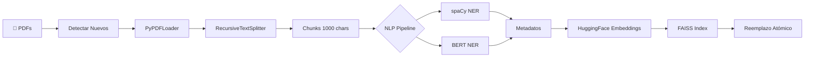
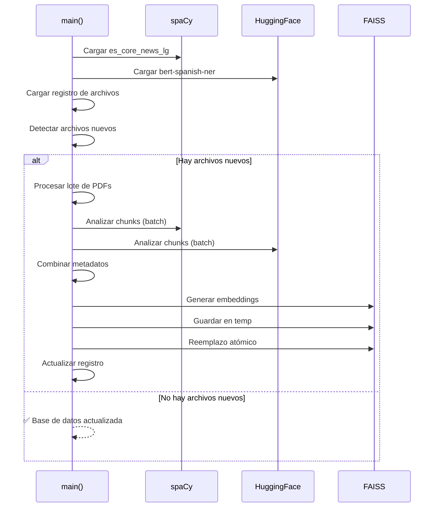

## Resumen

| Propiedad | Valor |
|-----------|-------|
| **Archivo** | `src/procesar_docs.py` |
| **Líneas de código** | 270 |
| **Propósito** | ETL de documentos PDF con enriquecimiento NLP |
| **Modelos NLP** | spaCy (es_core_news_lg) + BERT Spanish NER |

## Diagrama de Pipeline



## Configuración

```python
# Rutas del proyecto
RUTA_PROYECTO = Path(__file__).resolve().parent.parent
DIR_DOCS = RUTA_PROYECTO / "documentos"
DIR_DB_FAISS = RUTA_PROYECTO / "indice_faiss"
DIR_DB_TEMP = RUTA_PROYECTO / "indice_faiss_temp"  # Para atomicidad
ARCHIVO_REGISTRO = RUTA_PROYECTO / "processed_files.json"

# Modelos
EMBEDDING_MODEL = "all-MiniLM-L6-v2"
SPACY_MODEL = "es_core_news_lg"
RUTA_MODELO_HF = RUTA_PROYECTO / "models" / "bert-spanish-ner"
```

## Sistema de Registro Incremental

El sistema mantiene un JSON con timestamps de archivos procesados para evitar reprocesar documentos sin cambios.

### `cargar_registro_archivos()`

```python
def cargar_registro_archivos():
    """Carga el registro de archivos procesados desde JSON."""
    if not ARCHIVO_REGISTRO.exists():
        return {}
    with open(ARCHIVO_REGISTRO, 'r') as f:
        return json.load(f)
```

### `obtener_archivos_a_procesar()`

```python
def obtener_archivos_a_procesar(registro):
    """Determina qué archivos son nuevos o han sido modificados."""
    archivos_nuevos = []
    for archivo_pdf in DIR_DOCS.glob("*.pdf"):
        nombre_archivo = str(archivo_pdf)
        ultima_modificacion = os.path.getmtime(nombre_archivo)
        
        # Comparar timestamp con registro
        if nombre_archivo not in registro or registro[nombre_archivo] < ultima_modificacion:
            archivos_nuevos.append(nombre_archivo)
            registro[nombre_archivo] = ultima_modificacion
    return archivos_nuevos
```

<Note>
  Solo se procesan archivos **nuevos** o **modificados**, ahorrando tiempo y recursos.
</Note>

## Procesamiento de Documentos

### `procesar_lote_documentos()`

<ParamField path="rutas_archivos" type="List[str]" required>
  Lista de rutas absolutas a archivos PDF
</ParamField>

```python
def procesar_lote_documentos(rutas_archivos):
    """Carga y divide en chunks un lote de documentos PDF."""
    documentos = []
    for ruta in rutas_archivos:
        loader = PyPDFLoader(ruta)
        documentos.extend(loader.load())
    
    splitter = RecursiveCharacterTextSplitter(
        chunk_size=1000,      # Tamaño de cada chunk
        chunk_overlap=200,    # Overlap entre chunks
        length_function=len
    )
    return splitter.split_documents(documentos)
```

| Parámetro | Valor | Descripción |
|-----------|-------|-------------|
| `chunk_size` | 1000 | Caracteres por chunk |
| `chunk_overlap` | 200 | Overlap para contexto |
| `length_function` | len | Función para medir longitud |

## Enriquecimiento NLP

### Pipeline de Doble Estación

El enriquecimiento usa dos modelos NLP complementarios:

<CardGroup cols={2}>
  <Card title="Estación 1: spaCy" icon="language">
    **Modelo:** es_core_news_lg
    
    Extrae entidades generales en español:
    - ORG (Organizaciones)
    - PER (Personas)
    - LOC (Lugares)
    - MISC (Misceláneos)
  </Card>
  <Card title="Estación 2: BERT" icon="brain">
    **Modelo:** bert-spanish-ner
    
    NER especializado con deep learning:
    - Mayor precisión en contextos científicos
    - Entidades técnicas
  </Card>
</CardGroup>

### `analizar_chunks_batch()`

```python
@torch.no_grad()  # Desactiva gradientes (solo inferencia)
def analizar_chunks_batch(chunks_texto, spacy_nlp, hf_pipeline):
    """
    Analiza un lote de textos con spaCy y Hugging Face.
    El procesamiento en batch es más eficiente.
    """
    metadatos_enriquecidos = []
    
    # Estación 1: spaCy (procesamiento batch)
    spacy_docs = list(spacy_nlp.pipe(chunks_texto))
    
    # Estación 2: HuggingFace (procesamiento batch)
    hf_results = hf_pipeline(chunks_texto)
    
    # Combinar resultados
    for i, doc in enumerate(spacy_docs):
        # Procesar entidades de spaCy
        entidades_spacy = {}
        for ent in doc.ents:
            if ent.label_ not in entidades_spacy:
                entidades_spacy[ent.label_] = []
            entidades_spacy[ent.label_].append(ent.text)
        
        # Procesar entidades de HuggingFace
        entidades_hf = {}
        for entity in hf_results[i]:
            label = entity.get('entity_group', 'MISC')
            if label not in entidades_hf:
                entidades_hf[label] = []
            entidades_hf[label].append(entity['word'])
        
        metadatos_enriquecidos.append({
            "spacy_entities": entidades_spacy,
            "hf_entities": entidades_hf
        })
    
    return metadatos_enriquecidos
```

<Tip>
  El decorador `@torch.no_grad()` desactiva el cálculo de gradientes, reduciendo uso de memoria durante inferencia.
</Tip>

## Flujo Principal

### `main()`



## Actualización Atómica

Para garantizar integridad de datos, el sistema usa un proceso de actualización atómico:

<Steps>
  <Step title="Eliminar directorio temporal">
    ```python
    if DIR_DB_TEMP.exists():
        shutil.rmtree(DIR_DB_TEMP)
    ```
    Limpia cualquier ejecución anterior fallida.
  </Step>
  <Step title="Cargar o crear base de datos">
    ```python
    if DIR_DB_FAISS.exists() and chunks_nuevos:
        db_existente = FAISS.load_local(str(DIR_DB_FAISS), embeddings)
        db_existente.add_documents(chunks_nuevos)  # Fusionar
        db_final = db_existente
    else:
        db_final = FAISS.from_documents(chunks_nuevos, embeddings)
    ```
  </Step>
  <Step title="Guardar en directorio temporal">
    ```python
    db_final.save_local(str(DIR_DB_TEMP))
    ```
  </Step>
  <Step title="Reemplazo atómico">
    ```python
    if DIR_DB_FAISS.exists():
        shutil.rmtree(DIR_DB_FAISS)
    os.rename(DIR_DB_TEMP, DIR_DB_FAISS)
    ```
    
    <Warning>
      Si algo falla antes de este paso, la base de datos original permanece intacta.
    </Warning>
  </Step>
</Steps>

## Manejo de Errores

```python
try:
    # ... todo el procesamiento
except Exception as e:
    logging.error(f"❌ Error crítico: {e}")
    logging.info("La base de datos original no ha sido modificada.")
    
    # Limpiar directorio temporal
    if DIR_DB_TEMP.exists():
        shutil.rmtree(DIR_DB_TEMP)
```

## Ejecución

```bash
cd src
python procesar_docs.py
```

**Logs de salida esperados:**
```
2025-12-17 14:00:00 - INFO - 🚀 Iniciando proceso de actualización
2025-12-17 14:00:01 - INFO - Cargando modelo de spaCy: es_core_news_lg
2025-12-17 14:00:03 - INFO - Cargando modelo NER local
2025-12-17 14:00:05 - INFO - Se encontraron 5 archivos para procesar
2025-12-17 14:00:10 - INFO - Enriqueciendo 150 chunks con metadatos NLU
2025-12-17 14:00:20 - INFO - 🎉 ¡Proceso completado!
```
